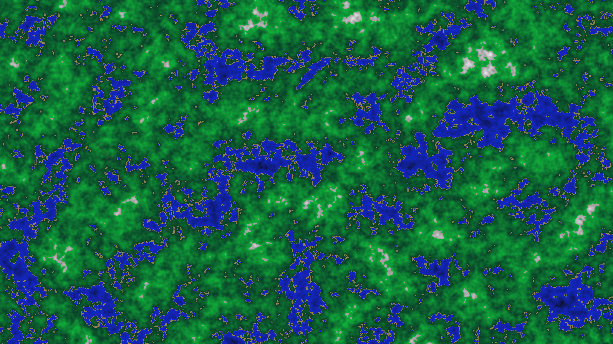
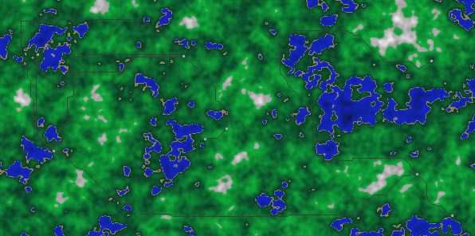

## Procedural Generation Sandbox
Messing around with terrain generation, some path finding and isometric projection.

* Adapted Ken Perlin's improved noise algorithm to Python
* Hand tuned some perlin noise map summations to generate world height maps
* Adapted an A* implementation I had previously written to create "train tracks" between stations at stations picked around the world
* Drew some pixel art isometric terrain cubes and projected them into pseudo 3D landscapes from the heightmaps

### Big World

### Train World

### Isometric World

